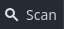

<h1>
  GDQuest Challenge: Text Adventure
</h1>
This repository serves as a practice project for learning <a href="https://godotengine.org">Godot Engine</a>, following the <a href="https://www.gdquest.com">GDQuest</a> course. It is intended purely for educational purposes and has no plans for further development. Please note that this repository is not affiliated with GDQuest.
 
 
<b>
  NOTE:
</b>
The project is considered "textbook-complete" but lacks extensive content for a fully engaging experience. However, it includes placeholders and core game mechanics that can be expanded upon for additional content.
<h2>
  Downloading the Project File
</h2>
To import the demo into the project manager:
 
 
<li>
  Clone this repository (or
  <a href="https://github.com/guacboy/gdquest-challenge-text-adventure/archive/refs/heads/main.zip">
    download
  </a>
  a ZIP archive)
</li>
<ul>
  <ul>
    <li><code>git clone https://github.com/guacboy/gdquest-challenge-text-adventure</code></li>
  </ul>
</ul>
<li>
  Open Godot's project manager and click the
  
  button on the top-left.
</li>
<li>
  Select the path to the folder containing the project files.
</li>
 
and voilà! Project should now appear in the project manager.
<h2>
  License and Assets
</h2>
This demo is distributed under the terms of the MIT license, as described in the <a href="https://github.com/guacboy/gdquest-challenge-text-adventure/blob/main/LICENSE">LICENSE.md</a> file. The asset(s) used for this demo are not mine and can be found in the link(s) below:
<li>
  https://edermunizz.itch.io/free-pixel-art-forest
</li>
<li>
  https://gandalfhardcore.itch.io/free-pixel-art
</li>
<li>
  https://nectanebo.itch.io/health-bars
<li>
  https://poppyworks.itch.io/silver
</li>
